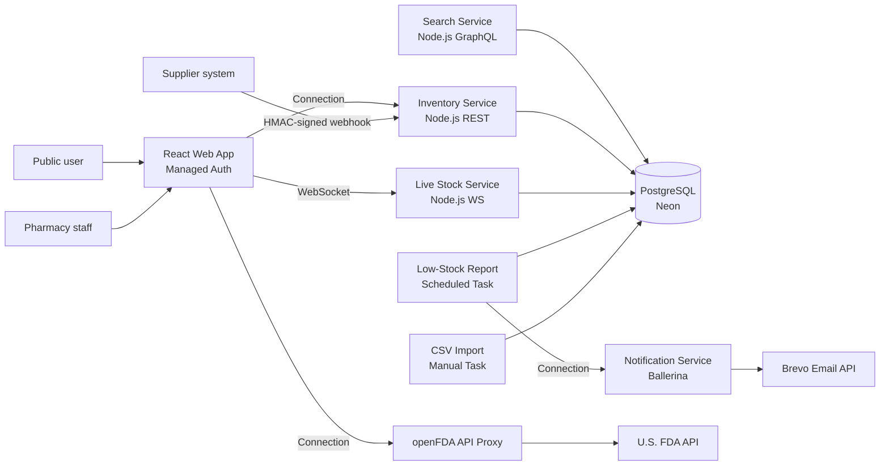

# 💊 MediFind: Medicine Availability Platform on WSO2 Choreo

MediFind helps people find which nearby pharmacies have a medicine in stock, and helps pharmacies
manage stock, receive supplier deliveries automatically, and get low-stock alerts.

**Live app:** [your web app URL]
**Demo video:** [YouTube/Drive link]

## Architecture

## WSO2 Choreo features used

| Area | Features |
|---|---|
| Component types | REST service, GraphQL service, WebSocket service, Ballerina service, API Proxy, Web Application, Scheduled Task, Manual Task |
| API management | OAuth2, per-resource security, permissions (scopes), CORS, rate limiting, resiliency, mediation policy, lifecycle (publish), Developer Portal, applications and subscriptions, OpenAPI / GraphQL / AsyncAPI definitions |
| Identity | Managed authentication, built-in IdP with users and groups, role → permission → group mapping |
| Integration | Connections (web app → APIs, task → service), Internal Marketplace, third-party APIs (openFDA, Brevo) |
| DevOps | Dev and Production environments, promotion, environment-specific configs and secrets, auto-deploy on push (CI/CD), scale-to-zero, health checks |
| Observability | Logs, metrics, alerts, API insights, delivery insights |
| Quality | Ballerina unit tests in the build, end-to-end smoke tests, API Chat |

## Repository structure
| Folder | Choreo component |
|---|---|
| `inventory-service/` | REST API + supplier webhook |
| `search-service/` | GraphQL API |
| `live-stock-service/` | WebSocket API |
| `notification-service/` | Ballerina email service |
| `webapp/` | React web application |
| `tasks/low-stock-report/` | Scheduled Task (daily 8:00 AM) |
| `tasks/csv-import/` | Manual Task |
| `database/` | Schema, seed data, migrations |
| `tests/` | Smoke tests and supplier webhook simulator |

## Design decisions
- **Webhook security:** HMAC-SHA256 signatures plus idempotent delivery IDs, so retries never double-count stock.
- **Least privilege:** public endpoints (search, drug info, live events) expose only non-sensitive data. All writes require the `stock:write` permission, granted through roles.
- **Cost-aware real-time updates:** the live service polls the database only while viewers are connected.
- **Safe imports:** CSV imports validate every row and run in one transaction, with a dry-run mode.

## Screenshots
See [`docs/screenshots`](docs/screenshots).
